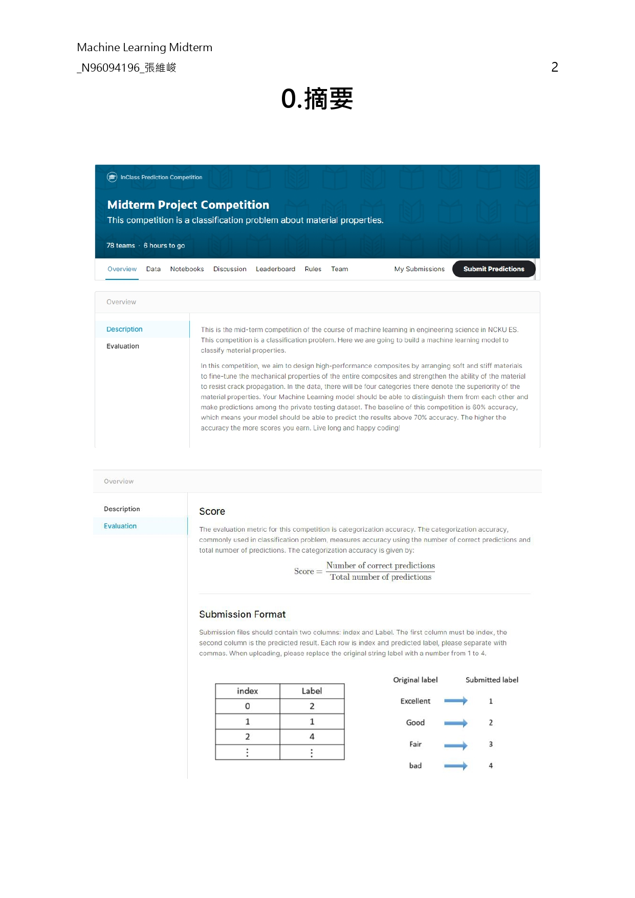
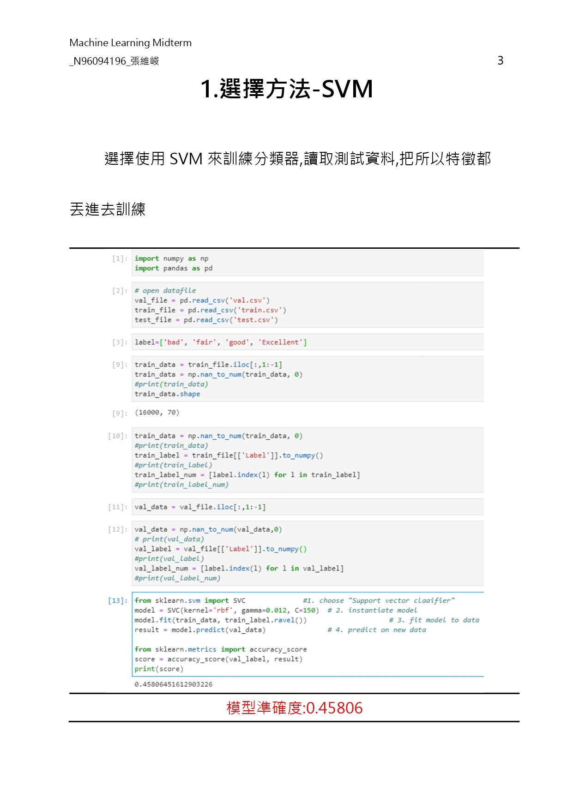
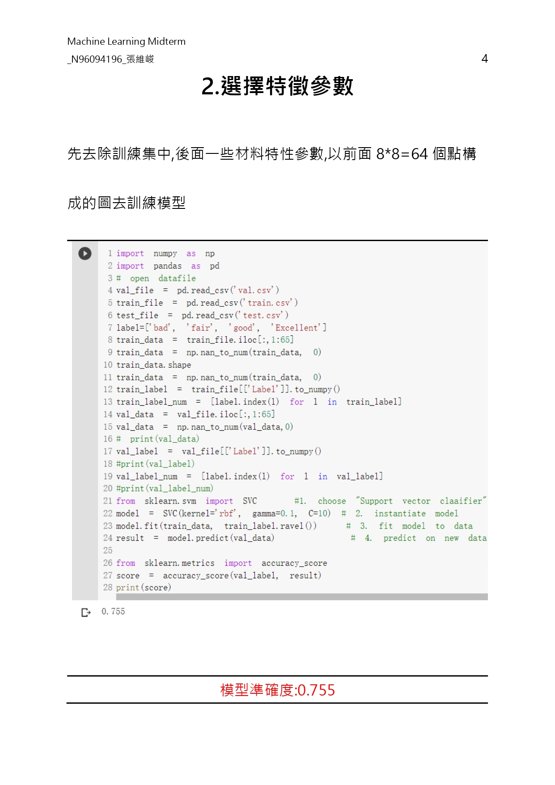
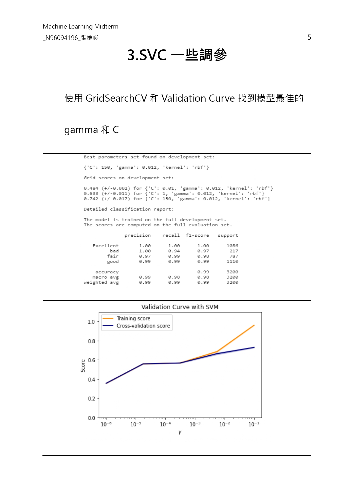
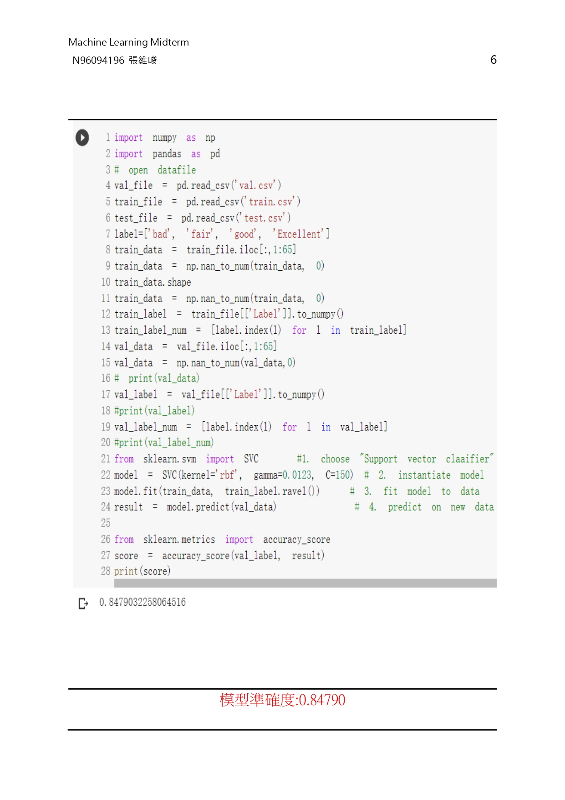
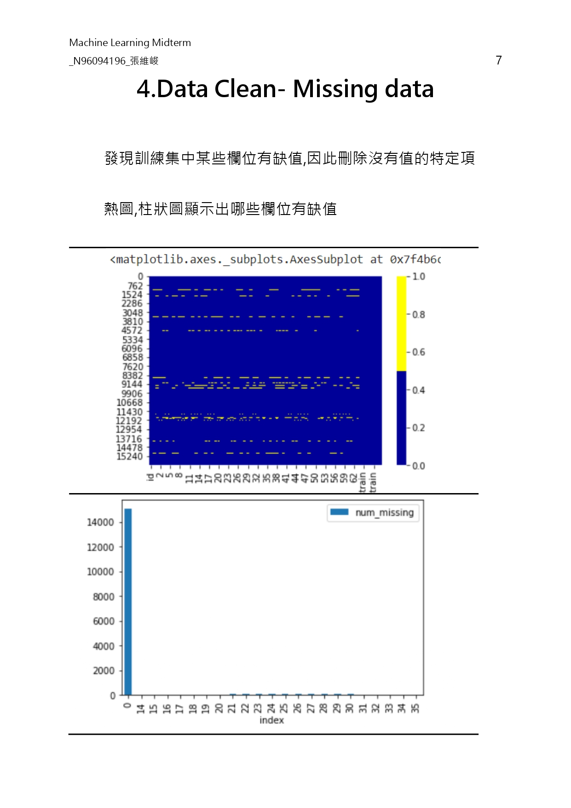
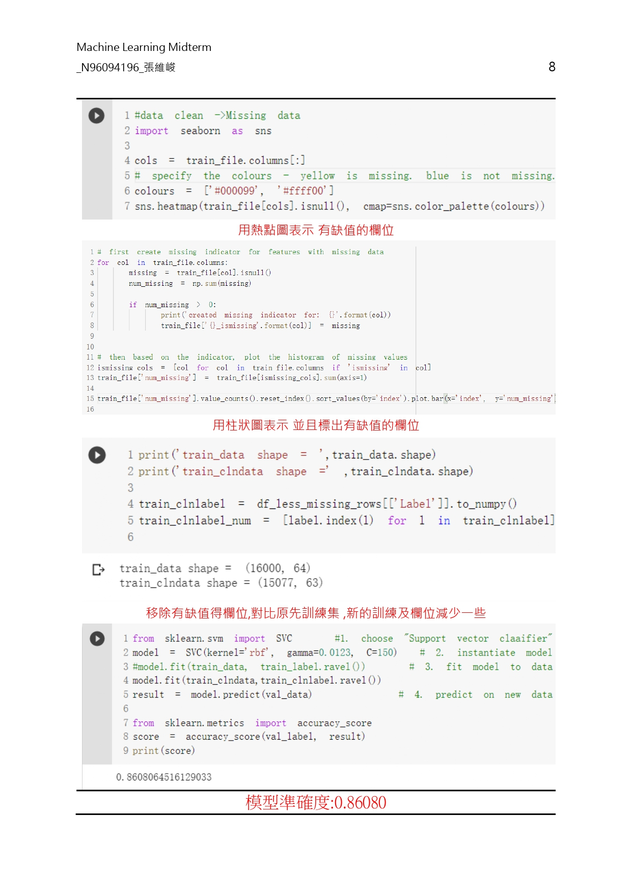
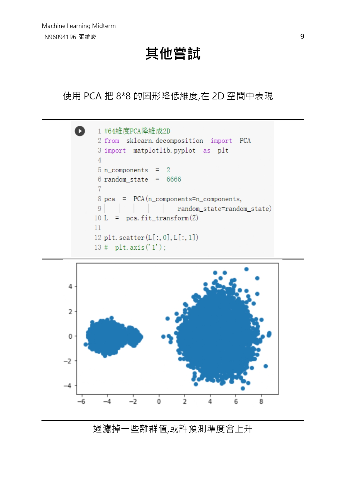

<!-- # ML_MaterialProperties
a classification problem about material properties.

Midterm 
Midterm Project Competition

0.摘要
 
 
1.選擇方法-SVM
選擇使用SVM來訓練分類器,讀取測試資料,把所以特徵都丟進去訓練
 
模型準確度:0.45806
2.選擇特徵參數
先去除訓練集中,後面一些材料特性參數,以前面8*8=64個點構成的圖去訓練模型
 
模型準確度:0.755
3.SVC一些調參
使用GridSearchCV 和Validation Curve找到模型最佳的   gamma和C
 

 

 

模型準確度:0.84790

4.Data Clean- Missing data
發現訓練集中某些欄位有缺值,因此刪除沒有值的特定項
熱圖,柱狀圖顯示出哪些欄位有缺值
 
 

 
用熱點圖表示 有缺值的欄位
 
用柱狀圖表示 並且標出有缺值的欄位 
 
移除有缺值得欄位,對比原先訓練集 ,新的訓練及欄位減少一些
 
模型準確度:0.86080
其他嘗試
使用PCA把8*8的圖形降低維度,在2D空間中表現
 
 

過濾掉一些離群值,或許預測準度會上升
 -->

